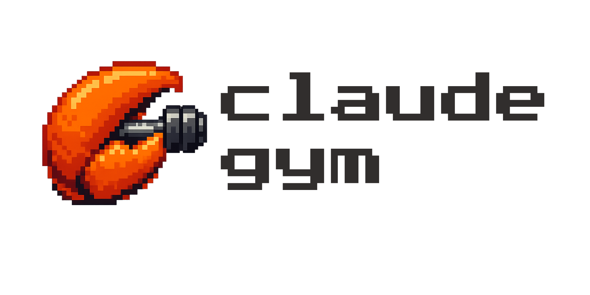
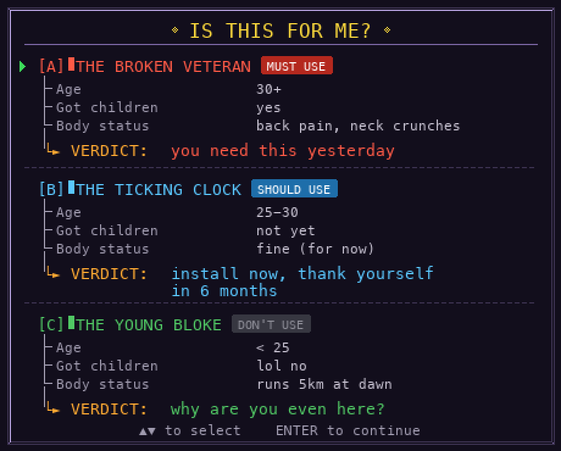

<p align="center">
  
  <br>
  <strong>A pixel-art exercise companion that nudges you to move during long Claude Code runs</strong>
</p>

<p align="center">
  <a href="https://github.com/477-Studio/claude-gym/releases"></a>
  <a href="https://www.npmjs.com/package/claude-gym"></a>
  <a href="LICENSE"></a>
</p>

<p align="center">
  
</p>

**You ship code. Your body ships pain.** Stand up. Stretch your back. Shake out your legs. It takes 30 seconds and your body will stop screaming at you by 6pm.

Claude Gym watches Claude Code's workflow and prompts quick deskside exercises at natural pauses — when CC enters plan mode, spawns agents, or goes on long tool streaks.

```bash
npm install -g claude-gym
```

New terminal tab, same project directory:

```bash
cgym
```

That's it. Luca (your pixel-art dev) appears in a cozy home office with Cookie the cat, waiting for the right moment to make you move.

If it saves your back even once, [leave a star](https://github.com/477-Studio/claude-gym) — it helps other CC users find this.

## Who This Is For

<p align="center">
  
</p>

## How It Works

It reads Claude Code's local JSONL logs. No API keys. No network. No telemetry. Just file watching.

- CC enters **plan mode** or **spawns a subagent** → Luca waves, "time to exercise!"
- CC goes on a **3+ tool call streak** → same thing, you're not needed anyway
- CC **needs you back** → prompt auto-dismisses, zero friction
- You're **mid-squat** and CC finishes? → Cookie the cat wakes up to let you know

More than ten exercises with pixel-art animations — squats, desk push-ups, wall sits, arm circles, and more.

## Install

<details>
<summary><strong>npm (recommended)</strong></summary>

```bash
npm install -g claude-gym
```

</details>

<details>
<summary><strong>Direct download</strong></summary>

Download the latest archive from [Releases](https://github.com/477-Studio/claude-gym/releases) and extract.

**macOS (Apple Silicon)**
```bash
curl -L https://github.com/477-Studio/claude-gym/releases/latest/download/claude-gym_latest_darwin_arm64.tar.gz | tar xz
sudo mv cgym-darwin-arm64 /usr/local/bin/cgym
```

**macOS (Intel)**
```bash
curl -L https://github.com/477-Studio/claude-gym/releases/latest/download/claude-gym_latest_darwin_amd64.tar.gz | tar xz
sudo mv cgym-darwin-amd64 /usr/local/bin/cgym
```

**Linux (x64)**
```bash
curl -L https://github.com/477-Studio/claude-gym/releases/latest/download/claude-gym_latest_linux_amd64.tar.gz | tar xz
sudo mv cgym-linux-amd64 /usr/local/bin/cgym
```

**Windows** — download the `.zip` from [Releases](https://github.com/477-Studio/claude-gym/releases), extract, and add `cgym-windows-amd64.exe` to your PATH.

</details>

<details>
<summary><strong>Build from source</strong></summary>

Requires Go 1.25+ with CGO enabled.

```bash
git clone https://github.com/477-Studio/claude-gym.git && cd claude-gym
go build -o cgym .
```

Linux deps: `sudo apt install libgl1-mesa-dev libxi-dev libxcursor-dev libxrandr-dev libxinerama-dev libxxf86vm-dev libwayland-dev libxkbcommon-dev`

</details>

## Usage

Run in a **separate terminal tab**, same directory as your CC session:

```bash
cgym                     # watch current project
cgym watch ~/other/dir   # watch a different project
```

## FAQ

**Is this an Anthropic product?** Nope. Community project, not affiliated.

**Does it phone home?** No. Zero network. Reads local files only.

**Why?** Because `git blame` can't explain your herniated disc.

## Contributing

This thing is early. There's a lot of low-hanging fruit:

- New exercises (got a good stretch? add it)
- New biomes (tired of the home office? build a cafe, a park, a space station)
- New characters (want Sally the vibe coder? Luca the dog? make them, we'll ship them)
- Windows testing (we believe it works, "believe" doing a lot of heavy lifting here)

See [CONTRIBUTING.md](CONTRIBUTING.md) for setup. [Good first issues](https://github.com/477-Studio/claude-gym/labels/good%20first%20issue) if you want a starting point.

## Disclaimer

The pixel-art animations are for fun, not instruction. They do not demonstrate proper exercise form — please research correct technique before attempting any movement.

If you feel any pain or discomfort, stop immediately and consult a physiotherapist or doctor. Do not exercise through injury. The authors of this project accept no responsibility for harm resulting from improper exercise.

## License

MIT — see [LICENSE](LICENSE). Originally inspired by [claude-quest](https://github.com/Michaelliv/claude-quest) by Michaelliv.

---

<p align="center">
  <code>git blame won't explain your herniated disc. but a ★ might prevent one.</code>
  <br><br>
  <a href="https://github.com/477-Studio/claude-gym">Star the repo</a> if your future self would thank you. &nbsp;
  <a href="https://github.com/477-Studio/claude-gym/issues">Open an issue</a> if something's broken or missing.
</p>
